# Database Schema — Single Source of Truth

**Status:** Living reference. **Verified against the live Supabase database**
(`gmmeaplomgotqtivevkg`, `public` schema) on 2026-09-05 — the live DB is authoritative;
this doc is kept to match it, not the other way round.
**Version:** 3.0.0
**Related:** `../constitution.md` (§6 architecture rules, §2.IX store models),
`roles-and-permissions.md` (role/permission catalog), `franchise-settlement.md`
(the settlement engine — proposed M1d, see §4).

> **How to re-verify:** with Docker running and the project linked,
> `supabase db dump --linked --schema public -f schema.sql` and diff against this doc.

---

## 0. What actually exists

**16 tables + 1 view are live.** Grouped below: Identity & Device, Tenancy/Roles/Access,
Franchise, Demo/QA. Conventions: UUID PKs (`gen_random_uuid()`), soft delete (`deleted_at`),
`last_modified_at` for last-write-wins where present, timestamps are `timestamptz`, money
(when it arrives) in integer paise.

**Speced but NOT yet migrated** (do not assume these exist): `stock_locations`,
`stock_transfers`, `settlement_statements`, and a `settlement_rules.plugin_id` column —
all belong to M1c/M1d, see §7.

```mermaid
erDiagram
    members ||--o{ devices : "enrolls"
    members ||--o{ memberships : "granted via"
    members ||--o{ access_grants : "grantee"
    roles ||--o{ memberships : "role_id"
    roles ||--o{ role_permissions : ""
    permissions ||--o{ role_permissions : ""
    roles ||--o{ store_invitations : "role_id"
    organizations ||--o{ stores : "owns"
    organizations ||--o{ memberships : "org scope"
    organizations ||--o{ store_invitations : "org invite"
    organizations ||--o{ franchise_groups : "franchisor"
    organizations ||--o{ demo_scenarios : ""
    stores ||--o{ memberships : "store scope"
    stores ||--o{ store_invitations : "store invite"
    stores ||--o{ channels : "sells via"
    stores ||--o{ franchise_memberships : "linked"
    franchise_groups ||--o{ franchise_memberships : ""
    franchise_groups ||--o{ settlement_rules : "terms"
    stores ||--|| store_business_model : "derives (view)"

    members {
        uuid id PK
        text google_id UK "nullable"
        text google_email "not null"
        boolean email_verified
        text pin "legacy/reserved — real PIN is devices.pin_hash"
        boolean is_active
        text first_name_last_name_avatar_locale
        text HR_fields "mobile, aadhaar, pan, emergency, DOJ, address"
    }
    devices {
        uuid id PK
        uuid device_id "hardware/browser id"
        uuid member_id FK
        text pin_hash "bcrypt — never raw"
        timestamptz pin_expires_at "30-day"
        int pin_failed_attempts
        timestamptz pin_locked_until
        text UNIQUE "device_id + member_id"
    }
    organizations {
        uuid id PK
        text name
        text registration_type "CHECK independent|chain|franchise"
        text status "CHECK trial|active|suspended|churned"
        text legal_name_gstin_pan_address "profile"
        smallint financial_year_start_month
        boolean is_demo
        uuid primary_contact_member_id FK
        uuid onboarded_by FK
    }
    stores {
        uuid id PK
        uuid organization_id FK
        text store_code
        text name
        text address_gstin_phone_email "profile"
        time opening_time_closing_time
    }
    roles {
        uuid id PK
        text name UK
        text scope_type "CHECK platform|organization|store"
        boolean is_system
    }
    permissions {
        uuid id PK
        text key UK
        text module
        boolean is_system
    }
    role_permissions {
        uuid role_id FK
        uuid permission_id FK
    }
    memberships {
        uuid id PK
        uuid member_id FK
        uuid role_id FK
        uuid organization_id FK "nullable"
        uuid store_id FK "nullable"
    }
    store_invitations {
        uuid id PK
        uuid store_id FK "nullable"
        uuid organization_id FK "nullable"
        uuid role_id FK
        text invited_email
        text token UK
        text status "CHECK pending|accepted|expired|revoked"
    }
    access_grants {
        uuid id PK
        uuid grantee_member_id FK
        text scope_type "CHECK organization|store"
        uuid scope_id
        text permission "CHECK read_only|reports_only|full"
    }
    channels {
        uuid id PK
        uuid store_id FK
        text channel_type "CHECK pos|online"
    }
    franchise_groups {
        uuid id PK
        uuid franchisor_org_id FK
        text name
    }
    franchise_memberships {
        uuid id PK
        uuid store_id FK
        uuid franchise_group_id FK
        date agreement_start
        date agreement_end "null = active"
    }
    settlement_rules {
        uuid id PK
        uuid franchise_group_id FK
        jsonb config "not null (no plugin_id yet — see §7)"
        date effective_from
        date effective_to
    }
    demo_scenarios {
        uuid id PK
        uuid organization_id FK
        text headline_problem_solution
        jsonb walkthrough_steps
    }
    qa_test_cases {
        uuid id PK
        text section_title_description
        text status "CHECK not_run|passed|failed|blocked"
        uuid last_run_by FK
    }
```



---

## 1. Identity & Device

### `members` — one row per verified person. Never carries a role or platform flag (that's `memberships`).
| Column | Type | Notes |
|---|---|---|
| `id` | uuid PK | |
| `google_id` | text, **unique**, nullable | Google `sub` — the dedup key |
| `google_email` | text, **not null** | display/contact |
| `email_verified` | boolean, default false | |
| `first_name`/`last_name`/`avatar_url`/`locale` | text, nullable | profile |
| `pin` | text, nullable | **Legacy/reserved** column (an old email-OTP idea). The real login PIN is `devices.pin_hash` — do not use this. |
| `is_active` | boolean, default true | |
| `mobile_number`/`aadhaar_number`/`pan_number` | text, nullable | staff HR fields |
| `emergency_contact_name`/`emergency_contact_phone` | text, nullable | |
| `date_of_joining` | date, nullable | |
| `address_line1`/`line2`/`city`/`state`/`pincode` | text, nullable | |
| `created_at`/`last_modified_at`/`deleted_at` | timestamptz | |

> There is **no `platform_role` column** — it was dropped. Platform-admin is a `memberships`
> row with a `platform_admin` role (both FK columns null).

### `devices` — gates PIN login, per (device, member) pair.
| Column | Type | Notes |
|---|---|---|
| `id` | uuid PK | server surrogate |
| `device_id` | uuid, not null | hardware/browser id (client localStorage) |
| `member_id` | uuid FK → members | |
| `device_label` | text | |
| `platform` | text, CHECK (`web`,`android`), default `web` | |
| `pin_hash` | text | bcrypt — never raw |
| `pin_created_at`/`pin_expires_at` | timestamptz | 30-day validity |
| `pin_failed_attempts` | int, default 0 | |
| `pin_locked_until` | timestamptz | clears only via fresh Google sign-in |
| `enrolled_at`/`last_seen_at` | timestamptz, default now | |
| `last_login_location` | text | informational only |
| `revoked_at`/`deleted_at` | timestamptz | |

**Unique index** `devices_device_member_idx` on (`device_id`, `member_id`) — a shared shop
tablet carries several members, each with an independent PIN.

**Auth flow (shipped):** Google sign-in → `mint-member-session` (upsert `members`, mint
custom JWT `sub=members.id`, 30-day) → device enroll → `set-pin` → `verify-pin`. Session
cached in Dexie keyed by `member_id` (offline-capable). Edge functions:
`supabase/functions/{mint-member-session,set-pin,verify-pin,demo-login}`.

---

## 2. Tenancy, Roles & Access

### `organizations` — top-level billing entity (independent owner, chain owner, or franchisor).
| Column | Type | Notes |
|---|---|---|
| `id` | uuid PK | |
| `name` | text, not null | |
| `registration_type` | text, CHECK (`independent`,`chain`,`franchise`), nullable | **Declared at provisioning** (via `provision_organization_with_contacts`). See §5 for how this relates to the *derived* per-store model. |
| `status` | text, CHECK (`trial`,`active`,`suspended`,`churned`), default `active` | |
| `is_demo` | boolean, default false | demo orgs from the admin Demo module |
| `legal_name`/`legal_entity_type`(CHECK proprietorship/partnership/llp/private_limited/huf/other)/`gstin`/`pan` | text | business registration |
| `address_line1`/`line2`/`city`/`state`/`pincode`/`country`(default India) | text | |
| `primary_contact_phone`/`primary_contact_member_id`(FK)/`website`/`logo_url` | | |
| `financial_year_start_month` | smallint, default 4, CHECK 1–12 | |
| `preferred_language`/`notes` | text | |
| `onboarded_by` | uuid FK → members | |
| `created_at`/`last_modified_at`/`deleted_at` | timestamptz | |

### `stores`
| Column | Type | Notes |
|---|---|---|
| `id` | uuid PK | |
| `organization_id` | uuid FK → organizations, not null | |
| `store_code` | text | feeds invoice numbering (constitution §6) |
| `name` | text | |
| `address_line1`/`line2`/`city`/`state`/`pincode`/`country`(default India) | text | |
| `phone_number`/`email`/`gstin` | text | (GSTIN is live now, not deferred) |
| `opening_time`/`closing_time` | time | |
| `created_at`/`last_modified_at`/`deleted_at` | timestamptz | |

### `roles` / `permissions` / `role_permissions` — the RBAC model. Catalog: `roles-and-permissions.md`.
- `roles`: `id`, `name` (unique), `scope_type` CHECK (`platform`,`organization`,`store`), `is_system` bool.
- `permissions`: `id`, `key` (unique), `module` (not null), `is_system` bool.
- `role_permissions`: (`role_id` FK, `permission_id` FK).

### `memberships` — the only thing that grants access.
`id`, `member_id` FK, `role_id` FK, `organization_id` FK (nullable), `store_id` FK (nullable),
`created_at`/`last_modified_at`/`deleted_at`. Platform rows: both FK null. Org rows:
`organization_id` only (cascades to every store). Store rows: `store_id` only.

**Entitlements & RLS** are enforced by SECURITY DEFINER functions (§6): `is_platform_admin()`,
`has_org_permission(org_id, key)`, `has_store_permission(store_id, key)`.

### `store_invitations` — invite-gated onboarding (org- or store-scoped).
`id`, `store_id` FK (nullable), `organization_id` FK (nullable), `invited_email`, `role_id` FK,
`token` (unique), `status` CHECK (`pending`,`accepted`,`expired`,`revoked`), `invited_by` FK,
`expires_at`, `created_at`/`deleted_at`.

### `access_grants` — generic cross-tenant read primitive.
`id`, `grantee_member_id` FK, `scope_type` CHECK (`organization`,`store`), `scope_id`,
`permission` CHECK (`read_only`,`reports_only`,`full`), `granted_by` FK, `expires_at`,
`created_at`/`deleted_at`.

### `channels` — sales channel per store.
`id`, `store_id` FK, `channel_type` CHECK (`pos`,`online`), `created_at`/`deleted_at`.

---

## 3. Franchise

### `franchise_groups` — a franchisor brand/entity (e.g. Bandrip).
`id`, `franchisor_org_id` FK → organizations, `name`, `created_at`/`deleted_at`.

### `franchise_memberships` — store ↔ franchise-group link (what makes a store "franchise").
`id`, `store_id` FK, `franchise_group_id` FK, `agreement_start` date, `agreement_end` date
(null=active), `created_at`/`last_modified_at`/`deleted_at`.

### `settlement_rules` — a franchise agreement's terms, versioned by effective date.
`id`, `franchise_group_id` FK, **`config` jsonb NOT NULL**, `effective_from` date,
`effective_to` date, `created_at`/`deleted_at`.

> **Live table stores `config` only.** The hybrid recipe/plugin design (a `plugin_id`
> column + one-source check) in `franchise-settlement.md` §4.5 is the **proposed M1d
> migration**, not yet applied. Until then, only data-driven `config` recipes exist.

---

## 4. Demo & QA (admin-only tooling)

### `demo_scenarios` — investor/demo narratives attached to a demo org.
`id`, `organization_id` FK, `headline`, `problem_statement`, `solution_narrative`,
`walkthrough_steps` jsonb, `created_at`/`last_modified_at`/`deleted_at`.

### `qa_test_cases` — a lightweight manual-QA tracker.
`id`, `section`, `title`, `description`, `status` CHECK (`not_run`,`passed`,`failed`,`blocked`),
`notes`, `last_run_at`, `last_run_by` FK, `created_at`/`last_modified_at`/`deleted_at`.

---

## 5. Derived business model — and a note on `registration_type`

The **`store_business_model` view** derives each store's model from relationships (live):

```sql
create or replace view store_business_model as
select s.id as store_id,
  case
    when fm.id is not null then 'franchise'
    when chain_counts.store_count > 1 then 'chain'
    else 'independent'
  end as business_model
from stores s
left join franchise_memberships fm
  on fm.store_id = s.id and fm.deleted_at is null
  and (fm.agreement_end is null or fm.agreement_end >= current_date)
left join (select organization_id, count(*) as store_count
           from stores where deleted_at is null group by organization_id) chain_counts
  on chain_counts.organization_id = s.organization_id
where s.deleted_at is null;
```

**Nuance to be aware of (a real tension, flagged honestly):** the constitution §2.IX / this
doc's design principle says a store's business model is *derived, never stored as an editable
label*. The live DB **does** store `organizations.registration_type` (independent/chain/
franchise), set once at provisioning. These are not the same thing and can legitimately
coexist: `registration_type` is the **org's declared intent at onboarding** (drives which
setup steps run); `store_business_model` is the **derived operational reality per store**.
The rule that still holds: **behavior decisions** (which settlement applies, Purchase-Trip vs
goods-received, franchisor access scope) must read the *view/relationships*, never
`registration_type`. If the two ever disagree for a store, the view wins. Worth a deliberate
decision later on whether `registration_type` should be relaxed to informational-only.

---

## 6. Functions (live)

**RLS/entitlement helpers (SECURITY DEFINER):** `is_platform_admin()`,
`has_org_permission(target_organization_id, permission_key)`,
`has_store_permission(target_store_id, permission_key)`.

**RPCs (write paths, all permission-gated):** `provision_organization_with_contacts`,
`invite_organization_member`, `invite_store_member`, `update_member_profile`,
`accept_pending_invitations`, `archive_store`, `restore_store`, `hard_delete_store`,
`hard_delete_organization`.

---

## 7. Not yet in schema (forward pointers)

- **`stock_locations` / `stock_transfers`** — central stock distribution (M1c). Designed in
  `franchise-settlement.md` / constitution §6; not migrated.
- **`settlement_statements`** — computed monthly settlements (M1d). Not migrated.
- **`settlement_rules.plugin_id`** + one-source check — the hybrid engine (M1d). Not migrated.
- Products / variant matrix / barcode — M3. Invoices / GST — M5. `content_items` (AI Studio) —
  see `../roadmap/future/ai-studio.md`.
- **Client offline mirror:** `src/db/` (Dexie) already scaffolds local stores
  (`products`, `invoices`, `outbox`, `members`, `entitlements`) ahead of their Supabase
  tables — the M2 sync layer will reconcile these with the server. They are client-side
  IndexedDB stores, not `public` tables, so they are not in the ERD above.

**UI ↔ DB check (2026-09-05):** the app reads/writes only tables that exist live
(`organizations`, `stores`, `memberships`, `roles`, `permissions`, `role_permissions`,
`franchise_groups`, `franchise_memberships`) plus the RPCs in §6 — no drift between the UI
data model and the diagram.

---

## 8. Changelog

- **v3.0.0 (2026-09-05)** — Re-verified against the **live Supabase DB** and corrected to
  match it: removed `stock_locations`/`stock_transfers`/`settlement_statements` (never
  migrated — moved to §7); added the live `demo_scenarios` and `qa_test_cases` tables; added
  the real extended columns on `organizations` (`registration_type`, `status`, `is_demo`,
  legal/address/FY fields), `stores` (address/gstin/hours), `members` (HR fields, `pin`,
  `is_active`), and `permissions`/`roles` (`module`/`is_system`); recorded `settlement_rules`
  as `config`-only (no `plugin_id` yet); documented the `registration_type` vs derived-view
  nuance (§5); listed live functions/RPCs (§6); replaced the stale hand-drawn SVG with an
  embedded, maintainable Mermaid ER diagram.
- **v2.0.0 (2026-09-05)** — Consolidated three schema docs into one; corrected the role model.
- **v1.x** — earlier per-doc schema drafts (pre-consolidation).
