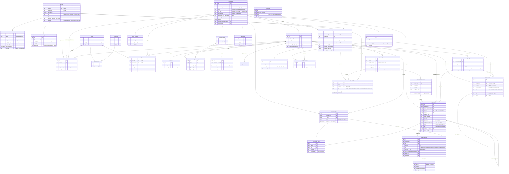

# Database Schema — Single Source of Truth

**Status:** Living reference. **Verified against the live Supabase database**
(`gmmeaplomgotqtivevkg`, `public` schema) on 2026-09-28 — tables, columns, CHECKs, unique
indexes, FK delete rules, RLS policies, triggers, functions and the migration history were
re-read from the catalog. The live DB is authoritative; this doc is kept to match it, not the
other way round. The ER diagram below is kept identical to `supabase/schema.mmd`.
**Version:** 3.9.1
**Related:** `../constitution.md` (§6 architecture rules, §2.IX store models),
`roles-and-permissions.md` (role/permission catalog), `franchise-settlement.md`
(the settlement engine — proposed M1d, see §4).

> **How to re-verify:** with Docker running and the project linked,
> `supabase db dump --linked --schema public -f schema.sql` and diff against this doc. Without
> Docker, query `pg_class` / `pg_constraint` / `pg_policies` / `pg_proc` and
> `supabase_migrations.schema_migrations` (local `supabase/migrations/` file names must match the
> recorded versions — 71 of 71 did on 2026-09-28).

---

## 0. What actually exists

**30 tables + 3 views are live, all with RLS enabled.** Grouped below: Identity & Device (2),
Tenancy/Roles/Access (8), Franchise (3), Purchase-Trip (M4, 5), Stock Placement (§3B,
`stock_locations`), Warehouses (§3C, 2), **Inventory (§3D, 7: `inventory_categories`,
`inventory_items`, `sku_counters`, `stock_transfers`, `stock_transfer_items`,
`stock_movements`)**, Demo/QA (2). Views: `store_business_model` (§5), `incoming_stock` (§3A —
price-free store-staff feed) and `stock_levels` (§3D — derived on-hand). Storage buckets:
`org-logos` (public) and `receipts` (private). Conventions: UUID PKs (`gen_random_uuid()`), soft
delete (`deleted_at`), `last_modified_at` for last-write-wins where present (not on
`sku_counters`), timestamps are `timestamptz`, money in integer paise.

**Speced but NOT yet migrated** (do not assume these exist): `settlement_statements` and a
`settlement_rules.plugin_id` column (M1d), store → store transfers, `label_prints`,
`reissue_inventory_item`, adjustments / stock count — see §7.


```mermaid
erDiagram
    members ||--o{ devices : "enrolls"
    members ||--o{ memberships : "granted via"
    members ||--o{ access_grants : "grantee"
    roles ||--o{ memberships : "role_id"
    roles ||--o{ role_permissions : ""
    permissions ||--o{ role_permissions : ""
    roles ||--o{ store_invitations : "role_id"
    organizations ||--o{ stores : "owns"
    organizations ||--o{ memberships : "org scope (also set on store rows)"
    organizations ||--o{ store_invitations : "org invite"
    organizations ||--o{ franchise_groups : "franchisor"
    organizations ||--o{ demo_scenarios : ""
    stores ||--o{ memberships : "store scope"
    stores ||--o{ store_invitations : "store invite"
    stores ||--o{ channels : "sells via"
    stores ||--o{ franchise_memberships : "linked"
    franchise_groups ||--o{ franchise_memberships : ""
    franchise_groups ||--o{ settlement_rules : "terms"
    stores ||--|| store_business_model : "derives (view)"
    organizations ||--o{ purchase_trips : "sources"
    members ||--o{ purchase_trips : "created_by"
    purchase_trips ||--o{ purchase_invoices : ""
    purchase_invoices ||--o{ purchase_invoice_items : ""
    purchase_trips ||--o{ trip_expenses : ""
    purchase_trips ||--o{ trip_activities : "journey log"
    purchase_invoices ||--o{ trip_activities : "ref_invoice"
    members ||--o{ trip_activities : "logged_by"
    organizations ||--o{ warehouses : "owns"
    warehouses ||--o{ warehouse_stores : ""
    stores ||--o{ warehouse_stores : "draws from"
    stores ||--o{ stock_locations : "display placements"
    warehouses ||--o{ stock_locations : "stock-room placements"
    stock_locations ||--o{ stock_locations : "parent_id (tree)"
    stores ||--o{ inventory_categories : "departments"
    inventory_categories ||--o{ stock_locations : "tags (category_id)"
    organizations ||--o{ inventory_items : "catalogues"
    purchase_invoice_items ||--o{ inventory_items : "split into"
    stores ||--o{ inventory_items : "allocated (null = UNA)"
    inventory_categories ||--o{ inventory_items : "category_id"
    inventory_items ||--o{ inventory_items : "replaced_by_item_id"
    organizations ||--o{ sku_counters : "SKU sequences"
    organizations ||--o{ stock_transfers : "dispatches"
    stores ||--o{ stock_transfers : "receives"
    stock_transfers ||--o{ stock_transfer_items : ""
    inventory_items ||--o{ stock_transfer_items : ""
    inventory_items ||--o{ stock_movements : "append-only log"
    stock_transfers ||--o{ stock_movements : "transfer_id"
    stock_movements ||--o{ stock_levels : "summed (view)"

    members {
        uuid id PK
        text google_id UK "nullable"
        text google_email "not null"
        boolean email_verified
        text pin "legacy/reserved — real PIN is devices.pin_hash"
        boolean is_active
        text first_name_last_name_avatar_locale
        text HR_fields "mobile, aadhaar, pan, emergency, DOJ, address"
    }
    devices {
        uuid id PK
        uuid device_id "hardware/browser id"
        uuid member_id FK
        text pin_hash "bcrypt — never raw"
        timestamptz pin_expires_at "30-day"
        int pin_failed_attempts
        timestamptz pin_locked_until
        text UNIQUE "device_id + member_id"
    }
    organizations {
        uuid id PK
        text name
        text registration_type "CHECK independent|chain|franchise"
        text status "CHECK trial|active|suspended|churned"
        text org_code "CHECK ^[A-Z0-9]{2,6}$ — UNA SKU prefix"
        jsonb label_settings "reserved: org label layout"
        text legal_name_gstin_pan_address "profile"
        smallint financial_year_start_month
        boolean is_demo
        uuid primary_contact_member_id FK
        uuid onboarded_by FK
    }
    stores {
        uuid id PK
        uuid organization_id FK
        text store_code "SKU prefix, e.g. BND-KDP"
        text name
        text address_gstin_phone_email "profile"
        time opening_time_closing_time
    }
    roles {
        uuid id PK
        text name UK
        text scope_type "CHECK platform|organization|store"
        boolean is_system
    }
    permissions {
        uuid id PK
        text key UK
        text module
        boolean is_system
    }
    role_permissions {
        uuid role_id FK
        uuid permission_id FK
    }
    memberships {
        uuid id PK
        uuid member_id FK
        uuid role_id FK
        uuid organization_id FK "null only for platform rows"
        uuid store_id FK "null = org-level"
    }
    store_invitations {
        uuid id PK
        uuid store_id FK "nullable"
        uuid organization_id FK "nullable"
        uuid role_id FK
        text invited_email
        text token UK
        text status "CHECK pending|accepted|expired|revoked"
    }
    access_grants {
        uuid id PK
        uuid grantee_member_id FK
        text scope_type "CHECK organization|store"
        uuid scope_id
        text permission "CHECK read_only|reports_only|full"
    }
    channels {
        uuid id PK
        uuid store_id FK
        text channel_type "CHECK pos|online"
    }
    franchise_groups {
        uuid id PK
        uuid franchisor_org_id FK
        text name
    }
    franchise_memberships {
        uuid id PK
        uuid store_id FK
        uuid franchise_group_id FK
        date agreement_start
        date agreement_end "null = active"
    }
    settlement_rules {
        uuid id PK
        uuid franchise_group_id FK
        jsonb config "not null (no plugin_id yet)"
        date effective_from
        date effective_to
    }
    demo_scenarios {
        uuid id PK
        uuid organization_id FK
        text headline_problem_solution
        jsonb walkthrough_steps
    }
    qa_test_cases {
        uuid id PK
        text section_title_description
        text status "CHECK not_run|passed|failed|blocked"
        uuid last_run_by FK
    }
    purchase_trips {
        uuid id PK
        uuid organization_id FK "sourcing org"
        uuid created_by FK
        text title
        text status "CHECK planning|active|completed|cancelled"
        jsonb route "planning legs"
        bigint planned_budget_paise
        bigint estimated_expenses_paise
        numeric expected_margin_pct
        timestamptz started_at_completed_at
    }
    purchase_invoices {
        uuid id PK
        uuid trip_id FK
        text supplier_name "free-text (no master yet)"
        jsonb margin_config "recipe; or…"
        text margin_plugin_id "…plugin (at most one)"
        text source "CHECK manual|ai_scan"
        text receiving_status "CHECK pending|in_transit|received|verified|ready_for_inventory"
    }
    purchase_invoice_items {
        uuid id PK
        uuid invoice_id FK
        text description
        int quantity
        bigint unit_cost_paise
        boolean is_trending "drives boosted margin"
        int received_quantity "null = unchecked"
    }
    trip_expenses {
        uuid id PK
        uuid trip_id FK
        text category "CHECK travel|lodging|food|transport|other"
        bigint amount_paise
    }
    trip_activities {
        uuid id PK
        uuid trip_id FK
        uuid member_id FK "who logged it"
        text kind "CHECK note|started|completed|arrived|expense|invoice|receipt_scan|cancelled"
        uuid ref_invoice_id FK "nullable"
        timestamptz occurred_at
    }
    warehouses {
        uuid id PK
        uuid organization_id FK
        text name
        text warehouse_type "CHECK backyard|stockroom|godown|other"
        int sort_order
    }
    warehouse_stores {
        uuid id PK
        uuid warehouse_id FK
        uuid store_id FK "unique pair among live rows"
    }
    stock_locations {
        uuid id PK
        uuid store_id FK "exactly one of store_id…"
        uuid warehouse_id FK "…or warehouse_id"
        uuid parent_id FK "self-ref; null = top level"
        text placement_type "CHECK floor|section|zone|rack"
        text code "unique per (owner,parent), case-insensitive"
        text direction_rack_row_rack_col "rack builder inputs"
        text color "CHECK palette token"
        uuid category_id FK "nullable"
    }
    inventory_categories {
        uuid id PK
        uuid organization_id FK
        uuid store_id FK
        text name "unique per store"
        text code "CHECK ^[A-Z0-9]{2,6}$; one name = one code org-wide"
        int next_sequence "unused (see sku_counters)"
    }
    inventory_items {
        uuid id PK
        uuid organization_id FK
        uuid source_invoice_item_id FK
        uuid store_id FK "null = unallocated (UNA)"
        uuid category_id FK
        text category_code
        text name_color_size
        int quantity
        bigint mrp_paise "tax-inclusive"
        bigint landed_unit_cost_paise "cost — org-only RLS"
        text status "CHECK draft|finalized|retired"
        text sku "unique per org; set by Finalize"
        uuid replaced_by_item_id FK
        int labels_printed
    }
    sku_counters {
        uuid organization_id PK
        text scope PK "store id or UNA"
        text category_code PK
        int next_seq
    }
    stock_transfers {
        uuid id PK
        uuid organization_id FK
        uuid to_store_id FK
        text status "CHECK dispatched|received"
        timestamptz dispatched_at_received_at
    }
    stock_transfer_items {
        uuid id PK
        uuid transfer_id FK
        uuid item_id FK
        int qty_sent
        int qty_received "null until received"
    }
    stock_movements {
        uuid id PK
        uuid organization_id FK
        uuid item_id FK
        int quantity "> 0"
        text kind "CHECK finalize|reissue|dispatch|receive|shortage|excess|place|move|adjust"
        text from_kind_to_kind "org|transit|store"
        uuid from_to_store_warehouse_location FK
        uuid transfer_id FK
        uuid member_id FK
    }
    stock_levels {
        uuid item_id "view: sum of movements"
        text loc_kind
        uuid store_warehouse_location
        int quantity
    }
```

---

## 1. Identity & Device

### `members` — one row per verified person. Never carries a role or platform flag (that's `memberships`).
| Column | Type | Notes |
|---|---|---|
| `id` | uuid PK | |
| `google_id` | text, **unique**, nullable | Google `sub` — the dedup key |
| `google_email` | text, **not null** | display/contact |
| `email_verified` | boolean, default false | |
| `first_name`/`last_name`/`avatar_url`/`locale` | text, nullable | profile |
| `pin` | text, nullable | **Legacy/reserved** column (an old email-OTP idea). The real login PIN is `devices.pin_hash` — do not use this. |
| `is_active` | boolean, default true | |
| `mobile_number`/`aadhaar_number`/`pan_number` | text, nullable | staff HR fields |
| `emergency_contact_name`/`emergency_contact_phone` | text, nullable | |
| `date_of_joining` | date, nullable | |
| `address_line1`/`line2`/`city`/`state`/`pincode` | text, nullable | |
| `created_at`/`last_modified_at`/`deleted_at` | timestamptz | |

> There is **no `platform_role` column** — it was dropped. Platform-admin is a `memberships`
> row with a `platform_admin` role (both FK columns null).

### `devices` — gates PIN login, per (device, member) pair.
| Column | Type | Notes |
|---|---|---|
| `id` | uuid PK | server surrogate |
| `device_id` | uuid, not null | hardware/browser id (client localStorage) |
| `member_id` | uuid FK → members | |
| `device_label` | text | |
| `platform` | text, CHECK (`web`,`android`), default `web` | |
| `pin_hash` | text | bcrypt — never raw |
| `pin_created_at`/`pin_expires_at` | timestamptz | 30-day validity |
| `pin_failed_attempts` | int, default 0 | |
| `pin_locked_until` | timestamptz | clears only via fresh Google sign-in |
| `enrolled_at`/`last_seen_at` | timestamptz, default now | |
| `last_login_location` | text | informational only |
| `revoked_at`/`deleted_at` | timestamptz | |

**Unique index** `devices_device_member_idx` on (`device_id`, `member_id`) — a shared shop
tablet carries several members, each with an independent PIN.

**Auth flow (shipped):** Google sign-in → `mint-member-session` (upsert `members`, mint
custom JWT `sub=members.id`, 30-day) → device enroll → `set-pin` → `verify-pin`. Session
cached in Dexie keyed by `member_id` (offline-capable). Edge functions:
`supabase/functions/{mint-member-session,set-pin,verify-pin,demo-login}`.

---

## 2. Tenancy, Roles & Access

### `organizations` — top-level billing entity (independent owner, chain owner, or franchisor).
| Column | Type | Notes |
|---|---|---|
| `id` | uuid PK | |
| `name` | text, not null | |
| `registration_type` | text, CHECK (`independent`,`chain`,`franchise`), nullable | **Declared at provisioning** (via `provision_organization_with_contacts`). See §5 for how this relates to the *derived* per-store model. |
| `status` | text, CHECK (`trial`,`active`,`suspended`,`churned`), default `active` | |
| `is_demo` | boolean, default false | demo orgs from the admin Demo module |
| `org_code` | text, nullable, CHECK `^[A-Z0-9]{2,6}$` | short org code (e.g. `BND`), prefix of unallocated-stock SKUs (`BND-UNA-…`). Not globally unique (SKUs are org-scoped). Backfilled 2026-09-27 from the shared store-code prefix, else initials |
| `label_settings` | jsonb, nullable | default barcode-label print layout (Inventory Phase 2C) |
| `legal_name`/`legal_entity_type`(CHECK proprietorship/partnership/llp/private_limited/huf/other)/`gstin`/`pan` | text | business registration |
| `address_line1`/`line2`/`city`/`state`/`pincode`/`country`(default India) | text | |
| `primary_contact_phone`/`primary_contact_member_id`(FK)/`website`/`logo_url` | | |
| `financial_year_start_month` | smallint, default 4, CHECK 1–12 | |
| `preferred_language`/`notes` | text | |
| `onboarded_by` | uuid FK → members | |
| `created_at`/`last_modified_at`/`deleted_at` | timestamptz | |

### `stores`
| Column | Type | Notes |
|---|---|---|
| `id` | uuid PK | |
| `organization_id` | uuid FK → organizations, not null | |
| `store_code` | text | feeds invoice numbering (constitution §6) |
| `name` | text | |
| `address_line1`/`line2`/`city`/`state`/`pincode`/`country`(default India) | text | |
| `phone_number`/`email`/`gstin` | text | (GSTIN is live now, not deferred) |
| `opening_time`/`closing_time` | time | |
| `created_at`/`last_modified_at`/`deleted_at` | timestamptz | |

### `roles` / `permissions` / `role_permissions` — the RBAC model. Catalog: `roles-and-permissions.md`.
- `roles`: `id`, `name` (unique), `scope_type` CHECK (`platform`,`organization`,`store`), `is_system` bool.
- `permissions`: `id`, `key` (unique), `module` (not null), `is_system` bool.
- `role_permissions`: (`role_id` FK, `permission_id` FK).

### `memberships` — the only thing that grants access.
`id`, `member_id` FK, `role_id` FK, `organization_id` FK (nullable), `store_id` FK (nullable),
`created_at`/`last_modified_at`/`deleted_at`. Platform rows: both FK null. Org rows:
`organization_id` set, `store_id` null (cascades to every store of the org). **Store rows:
`store_id` set and `organization_id` also set** to the store's org (`invite_store_member` writes
both; live 2026-09-28: 9 of 9 store rows). So "org-level" means `store_id IS NULL`, never merely
`organization_id IS NOT NULL` — the rule the permission helpers follow since the 2026-09-28 fix
(§6).

**Entitlements & RLS** are enforced by SECURITY DEFINER functions (§6): `is_platform_admin()`,
`has_org_permission(org_id, key)`, `has_store_permission(store_id, key)`.

### `store_invitations` — invite-gated onboarding (org- or store-scoped).
`id`, `store_id` FK (nullable), `organization_id` FK (nullable), `invited_email`, `role_id` FK,
`token` (unique), `status` CHECK (`pending`,`accepted`,`expired`,`revoked`), `invited_by` FK,
`expires_at`, `created_at`/`deleted_at`.

### `access_grants` — generic cross-tenant read primitive.
`id`, `grantee_member_id` FK, `scope_type` CHECK (`organization`,`store`), `scope_id`,
`permission` CHECK (`read_only`,`reports_only`,`full`), `granted_by` FK, `expires_at`,
`created_at`/`deleted_at`.

### `channels` — sales channel per store.
`id`, `store_id` FK, `channel_type` CHECK (`pos`,`online`), `created_at`/`deleted_at`.

---

## 3. Franchise

### `franchise_groups` — a franchisor brand/entity (e.g. Bandrip).
`id`, `franchisor_org_id` FK → organizations, `name`, `created_at`/`deleted_at`.

### `franchise_memberships` — store ↔ franchise-group link (what makes a store "franchise").
`id`, `store_id` FK, `franchise_group_id` FK, `agreement_start` date, `agreement_end` date
(null=active), `created_at`/`last_modified_at`/`deleted_at`.

### `settlement_rules` — a franchise agreement's terms, versioned by effective date.
`id`, `franchise_group_id` FK, **`config` jsonb NOT NULL**, `effective_from` date,
`effective_to` date, `created_at`/`deleted_at`.

> **Live table stores `config` only.** The hybrid recipe/plugin design (a `plugin_id`
> column + one-source check) in `franchise-settlement.md` §4.5 is the **proposed M1d
> migration**, not yet applied. Until then, only data-driven `config` recipes exist.

---

## 3A. Purchase-Trip (M4)

Records a buying trip and its purchases; landed cost, MRP, and forecast are **derived**
(computed in `lib/`, not stored). Belongs to the **sourcing organization** (org-type
independent). Design: `../roadmap/purchase-trips.md`. Migration:
`20260905000000_m4_purchase_trips.sql`. RLS gates on `trip.read` (SELECT) / `trip.create`
(write) via `has_org_permission`; child tables reach the org via their parent trip; DELETE
is platform-admin-only (app soft-deletes via UPDATE). Money in integer paise.

### `purchase_trips`
`id`, `organization_id` FK (sourcing org), `created_by` FK → members, `title`,
`status` CHECK (`planning`,`active`,`completed`,`cancelled`), `start_date`, `end_date`, `route` jsonb
(multi-leg planning table:
`[{from,to,boarding,drop_point,distance_km,mode,price_paise,planned_purchase_paise}]`;
`planned_purchase_paise` = the "cart" spend planned at that location;
`distance_km` is form-required, the "Verify on map" link is generated free from from/to/mode
at render, not stored — jsonb, so the leg shape changes with no migration),
`planned_budget_paise`, `estimated_expenses_paise`,
`expense_estimate_source` CHECK
(`manual`,`ai`), `expected_margin_pct`, `notes`, **`started_at`**, **`completed_at`** (active
phase), `last_modified_at`, `deleted_at`.

### `purchase_invoices`
`id`, `trip_id` FK, `supplier_name` (free-text; no suppliers master yet), `supplier_gstin`,
`supplier_invoice_no`, `invoice_date`, `margin_config` jsonb **or** `margin_plugin_id` text
(one-source check), `notes`, **`source`** CHECK (`manual`,`ai_scan`) default manual,
**`receipt_path`** (Supabase Storage), **`ai_confidence`** CHECK (`high`,`medium`,`low`),
**`needs_review`** bool (low/medium scan → owner eyeballs), **`arrived_at`** (received-at
timestamp; null = not yet received), **`receiving_status`** CHECK
(`pending`,`in_transit`,`received`,`verified`,`ready_for_inventory`) default `pending` — the
per-invoice receiving pipeline (the Deliveries module, `../roadmap/deliveries.md`);
`ready_for_inventory` hands off to M3 inventory — **`verified_at`**, **`approved_at`**
(the ready-for-inventory time), `last_modified_at`, `deleted_at`.

### `purchase_invoice_items`
`id`, `invoice_id` FK, `description` (→ product in M3), `hsn_code`, `quantity` (>0),
`unit_cost_paise` (≥0), `is_trending` bool, **`received_quantity`** (int ≥0 or null — the
line-level goods check on the Deliveries invoice detail; null = unchecked, may differ from
`quantity` = shortage/excess; all items must be set to move an invoice `received`→`verified`),
**`receiving_note`** (per-item comment), `last_modified_at`, `deleted_at`.

### `trip_expenses`
`id`, `trip_id` FK, `category` CHECK (`travel`,`lodging`,`food`,`transport`,`other`),
`amount_paise` (≥0), `note`, `last_modified_at`, `deleted_at`.

### `trip_activities` (active-phase journey log)
`id`, `trip_id` FK, `member_id` FK (who logged it), `kind` CHECK
(`note`,`started`,`completed`,`arrived`,`expense`,`invoice`,`receipt_scan`,`cancelled`), `note`,
`ref_invoice_id` FK (optional link to an invoice/scan), `occurred_at`, `last_modified_at`,
`deleted_at`. Same RLS shape as the other purchase_* child tables.

### `incoming_stock` (view — price-free store-staff feed)
Migration `20260905010000_m4_incoming_stock_visibility.sql` (arrival column added in
`20260908000000_m4_cancel_and_arrival.sql`). Exposes ONLY `trip_id`,
`organization_id`, `status`, `trip_title`, `expected_by`, `item_id`, `description`,
`quantity`, `arrived_at`, `receiving_status` (per-invoice receiving stage, so store staff see
in-transit / received / verified / approved) — **no cost / landed / MRP / margin / budget /
expense column exists in it**, so
nothing financial can leak to store staff. `security_invoker = false` (reads the base
tables past their `trip.read` RLS); per-row access is gated by the
`has_incoming_visibility(org)` helper. Granted to `authenticated`; the new
`trip.view_incoming` permission (store_sales_staff / store_temp_staff / store_manager) is
what `has_incoming_visibility` checks for store staff. See `roles-and-permissions.md`.

---

## 3B. Stock Placement (M3) — the first Inventory table

Full spec: [`roadmap/stock-placement.md`](../roadmap/stock-placement.md). Where stock physically
sits in a store or stock room — the `from_/to_location_id` of `stock_movements` (§3D).

### `stock_locations` — one location tree, owned by a store **or** a warehouse
`id`, **`store_id`** FK (nullable) **or `warehouse_id`** FK (nullable) — **exactly one is set**
(CHECK `stock_locations_one_owner`, added 2026-09-18 for Warehouses); **`parent_id`** FK →
`stock_locations.id` (self-reference; null = top level), `placement_type` CHECK
(`floor`,`section`,`zone`,`rack`) — floor/section are containers, zone/rack are leaf placements;
every level optional (a flat boutique, a multi-floor showroom, or a godown — same table). `code`
(the identifier; **unique per (owner, parent_id), case-insensitive**, among non-deleted — owner =
`coalesce(store_id, warehouse_id)`; index `stock_locations_sibling_code_uniq`), `label`. Rack-only builder inputs: `direction` CHECK (8
compass points), `rack_row`, `rack_col` — `code` is generated `{dir}-{row}-{col}` (e.g. `E-03-02`)
but editable. `color` CHECK (`red`,`amber`,`green`,`teal`,`blue`,`violet`,`pink`,`slate`) —
optional palette token for quick visual ID (aid only; the code is always shown). `layout` jsonb —
**reserved** for a future visual planogram, unused. **`category_id`** FK → `inventory_categories`
(nullable, `on delete set null`; store-owned locations only) — optionally tags a location with a
store category ("this rack is Kids", see §3D; added 2026-09-26). `sort_order`, `last_modified_at`,
`deleted_at`.

Offline-first (mirrored in Dexie, synced via the outbox like the `purchase_*` tables). **Dual-scope
RLS** (2026-09-18): a **store-owned** row uses the store-scoped helper `has_store_permission()` —
**design** (insert/update/delete) gated on **`store.edit`** (org_owner/org_manager), **read** on
**`inventory.read`** (also store sales/temp staff). A **warehouse-owned** row uses the org-scoped
`has_org_permission()` against the warehouse's org for **`store.edit`** (design), and reads on
**`inventory.read`** at that org **or** for any member holding `inventory.read` on a store attached
to the warehouse via `warehouse_stores` (so store staff can pick godown locations their store draws
from). Soft-delete only; hard DELETE is platform-admin-only. Cascade-deletes with its owner (FK
`on delete cascade`), and `hard_delete_organization` purges both store- and warehouse-owned rows.

## 3C. Warehouses / Stock rooms (M3 prerequisite) — org-owned storage spaces

Full spec: [`roadmap/warehouses.md`](../roadmap/warehouses.md). A **warehouse** (UI: "Stock Room")
is a storage space — backyard / understairs / stockroom / godown — that holds stock **outside** a
store's selling floor. It is **not** a retail outlet (own table, not a `stores` flag), so it never
touches the `store_business_model` view. Built before Inventory intake so a received SKU can be
placed into a warehouse from day one. Live 2026-09-18 (migrations `20260918100000_warehouses`,
`20260918100100_stock_locations_warehouse_owner`, `20260918100200_hard_delete_organization_warehouses`).

### `warehouses` — the storage space
`id`, `organization_id` FK (org-owned), `name`, `warehouse_type` CHECK
(`backyard`,`stockroom`,`godown`,`other`) — a label/aid, not behaviour; `note`, `sort_order`,
`last_modified_at`, `deleted_at`. Internal placement (shelves/zones/racks) reuses `stock_locations`
via `warehouse_id` (§3B). Org-scoped RLS (`has_org_permission`): design = `store.edit`
(org_owner/org_manager), read = org members with `inventory.read`/`store.edit`; hard DELETE
platform-admin-only. Offline-first (Dexie + outbox).

### `warehouse_stores` — many-to-many attach (warehouse ↔ stores)
`id`, `warehouse_id` FK, `store_id` FK, `last_modified_at`, `deleted_at`. **Unique
`(warehouse_id, store_id)` among non-deleted.** A central godown links many stores; a store's own
backyard links exactly one; an unattached org warehouse links none. Drives which warehouse
locations a store sees in the intake picker. RLS: read = warehouse-org owner/manager **or** a
member with `inventory.read` on the linked store; design (attach/detach) = `store.edit` at the
warehouse's org; hard DELETE platform-admin-only.

## 3D. Inventory categories (Inventory — phase 1) — store-scoped departments

Full spec: [`roadmap/inventory.md`](../roadmap/inventory.md). The first table of the **Inventory**
module proper. Each store defines its **own** categories (Sarees / Dress Material / Kids / …) — an
org can have "Kids" in one store and not another, so categories are **store-scoped**, not org-wide.
Set up per store in the wizard's Stores step; a `stock_locations` row can be tagged with one
(`category_id`, §3B). Live 2026-09-26 (migration `20260926170130_inventory_categories`; the local
file was named `20260926100000` until 2026-09-28 and has been renamed to the recorded version).

### `inventory_categories` — a store's product category/department
`id`, `organization_id` FK, `store_id` FK, `name` (**unique per store** among non-deleted),
**`code`** text not null, CHECK `^[A-Z0-9]{2,6}$`, unique per store among non-deleted — the SKU
`{CAT}` segment (Sarees → `SAR`). **One name ↔ one code across the org**, enforced by triggers:
`inventory_categories_assign_code` (BEFORE insert/update: reuses the org's code for the name, else a
valid supplied code, else `inventory_category_code_for()` — first 3 letters, suffixed on a clash;
corrects rather than rejects, and bumps `last_modified_at` so devices re-pull) and
`inventory_categories_propagate_code` (AFTER update of code, security definer: a code edit applies to
that name in every store of the org). `next_sequence` int default 1 (**unused**; superseded by
`sku_counters`, below), `last_modified_at`, `deleted_at`. Store-scoped RLS
via `has_store_permission()` (which cascades org-level org_owner/org_manager): **read** = `inventory.read`,
**write** (insert/update, incl. soft-delete) = `inventory.write`; hard DELETE platform-admin-only.
Offline-first (Dexie + outbox), pushed **before** `stock_locations` (a location may reference it).
FK `on delete cascade` from org/store, so `hard_delete_organization` clears it.

---

### `inventory_items` — one row per SKU (Inventory Phase 2B, live 2026-09-27)
Unique index `inventory_items_org_sku_uq (organization_id, sku) where sku is not null`.
A Ready-for-Inventory invoice line split by colour × size × store, catalogued and priced at the
org. `id`, `organization_id` FK (cascade), `source_invoice_item_id` FK → `purchase_invoice_items`
(set null), `store_id` FK (set null; **NULL = unallocated**), `category_id` FK →
`inventory_categories` (set null), `category_code` (CHECK `^[A-Z0-9]{2,6}$`), `name`, `color`,
`size` (non-blank), `quantity` int > 0, `mrp_paise` bigint ≥ 0 (tax-**inclusive**),
`landed_unit_cost_paise` bigint ≥ 0 (**cost**), `status` (`draft`/`finalized`/`retired`, default
draft), `sku` (**unique per org** where set; present exactly when not draft — CHECK),
`replaced_by_item_id` (self FK), `finalized_at`, `labels_printed` int ≥ 0, `created_by` FK →
members (set null), `last_modified_at`, `deleted_at`. **Org-only RLS** (select/insert/update:
`is_platform_admin()` or `has_org_permission(org, 'inventory.manage')`), because rows carry
cost; no DELETE policy (drafts soft-delete). Stores read items only through the price-free
`store_stock` / `store_incoming` RPCs below. **`inventory_items_guard`** trigger: clients insert
drafts only; SKU/status are set only on the RPC path (session flag
`tallythreads.inventory_rpc`, set by `finalize_inventory_items` / `dispatch_stock`); once finalized, `sku`/`status`/`store_id`/
`category_code`/`color`/`size` are frozen (retire + reissue instead). Offline-first (Dexie v12,
pushed after categories/locations). Migration `20260927195747_inventory_items`.

### Inventory distribution (Phases 2C–2E, live 2026-09-28)
Migration `20260927222247_inventory_distribution`. Spec: `../roadmap/inventory.md` §5, §8.

- **`sku_counters`** — `(organization_id, scope, category_code)` PK, `next_seq` int default 1;
  `scope` = a store id (as text) or `'UNA'`; FK org cascade; no `last_modified_at` / `deleted_at`
  (server-only, not synced). Written only by `next_inventory_sku()` (upsert = row lock, so numbers never
  collide); select for `inventory.manage`. Supersedes `inventory_categories.next_sequence`.
- **`stock_transfers`** — dispatch org → store: `organization_id`, `to_store_id`, `status`
  (`dispatched`/`received`), `note`, `dispatched_at/by`, `received_at/by`, `last_modified_at`,
  `deleted_at` (FKs: org and store cascade; members set null). **`stock_transfer_items`** —
  `organization_id`, `transfer_id` (cascade), `item_id` (cascade), `qty_sent` > 0, `qty_received`
  ≥ 0 (null until received), `last_modified_at`, `deleted_at`. Select: the org (`inventory.manage`) or the receiving store
  (`inventory.read`). **No client write policies** — written by the RPCs only.
- **`stock_movements`** — the **append-only** stock log: `item_id`, `quantity` > 0, `kind`
  (`finalize`/`reissue`/`dispatch`/`receive`/`shortage`/`excess`/`place`/`move`/`adjust`), a
  from side and a to side, each `kind` ∈ `org`/`transit`/`store` + `store_id` / `warehouse_id` /
  `location_id`, `transfer_id`, `reason`, `member_id`, `created_at`, `last_modified_at`,
  `deleted_at`. CHECKs keep sides coherent: at least one side; an `org` side has no store; a
  `transit`/`store` side has one. FKs: item, org and stores cascade; warehouse, location,
  transfer and member set null. No DELETE policy.
  RLS: select for the org or `has_store_permission(coalesce(to_store_id, from_store_id),
  'inventory.read')`; insert/update for the org, or store staff with `inventory.write` for
  `place`/`move` **within one store**. Triggers: `stock_movements_immutable` (rows never change;
  an identical re-push is allowed) and `stock_movements_validate` (locations must belong to the
  store — `stock_location_in_store()`). Client: Dexie v13, **push-only** (never pulled).
- **`stock_levels`** (view, `security_invoker`) — on-hand per `(item, loc_kind, store, warehouse,
  location)`, summed from movements; zero rows dropped. Callers see what their movement RLS allows.
- **RPCs (SECURITY DEFINER, `authenticated` only, permission-checked inside):**
  `finalize_inventory_items(uuid[])` → setof `inventory_items` (SKU, store category, `finalize`
  movement into org holding); `dispatch_stock(store, jsonb lines, note)` → `{transfer_id,
  reissued[]}` (UNA → new store-SKU item, UNA retired when fully moved); `receive_transfer(transfer,
  jsonb lines, warehouse?, location?)`; `store_stock(store)` (price-free); `store_incoming(store)`
  (jsonb, price-free). Helpers: `sku_segment(text)`, `next_inventory_sku(...)` (no API execute),
  `stock_location_in_store(...)`.

---

## 4. Demo & QA (admin-only tooling)

### `demo_scenarios` — investor/demo narratives attached to a demo org.
`id`, `organization_id` FK, `headline`, `problem_statement`, `solution_narrative`,
`walkthrough_steps` jsonb, `created_at`/`last_modified_at`/`deleted_at`.

### `qa_test_cases` — a lightweight manual-QA tracker.
`id`, `section`, `title`, `description`, `status` CHECK (`not_run`,`passed`,`failed`,`blocked`),
`notes`, `last_run_at`, `last_run_by` FK, `created_at`/`last_modified_at`/`deleted_at`.

---

## 5. Derived business model — and a note on `registration_type`

The **`store_business_model` view** derives each store's model from relationships (live):

```sql
create or replace view store_business_model as
select s.id as store_id,
  case
    when fm.id is not null then 'franchise'
    when chain_counts.store_count > 1 then 'chain'
    else 'independent'
  end as business_model
from stores s
left join franchise_memberships fm
  on fm.store_id = s.id and fm.deleted_at is null
  and (fm.agreement_end is null or fm.agreement_end >= current_date)
left join (select organization_id, count(*) as store_count
           from stores where deleted_at is null group by organization_id) chain_counts
  on chain_counts.organization_id = s.organization_id
where s.deleted_at is null;
```

**Nuance to be aware of (a real tension, flagged honestly):** the constitution §2.IX / this
doc's design principle says a store's business model is *derived, never stored as an editable
label*. The live DB **does** store `organizations.registration_type` (independent/chain/
franchise), set once at provisioning. These are not the same thing and can legitimately
coexist: `registration_type` is the **org's declared intent at onboarding** (drives which
setup steps run); `store_business_model` is the **derived operational reality per store**.
The rule that still holds: **behavior decisions** (which settlement applies, Purchase-Trip vs
goods-received, franchisor access scope) must read the *view/relationships*, never
`registration_type`. If the two ever disagree for a store, the view wins. Worth a deliberate
decision later on whether `registration_type` should be relaxed to informational-only.

---

## 6. Functions (live)

**RLS/entitlement helpers (SECURITY DEFINER):** `is_platform_admin()`,
`has_org_permission(target_organization_id, permission_key)`,
`has_store_permission(target_store_id, permission_key)`,
`has_incoming_visibility(target_org)` (gates the `incoming_stock` view — §3A),
`warehouse_serves_readable_store(warehouse_id)` (store staff read their attached stock rooms).
**Scope rule (fixed 2026-09-28):** the org-level branch of `has_org_permission` /
`has_store_permission` matches only memberships with `store_id IS NULL`. A store membership
also carries its store's `organization_id`, and before `20260927222039_fix_permission_scope`
it was wrongly treated as org-level (store staff got their role in every store of the org).

**Trigger & internal functions:** `inventory_categories_assign_code()`,
`inventory_categories_propagate_code()` (definer), `inventory_category_code_for(org, name,
exclude_id)`, `inventory_items_guard()`, `stock_movements_immutable()`,
`stock_movements_validate()`, `next_inventory_sku(org, store, category_code, color, size)`,
`sku_segment(text)`, `stock_location_in_store(store, warehouse, location)` (definer). API EXECUTE
is revoked on the trigger functions and `next_inventory_sku`.

**RPCs (write paths, all permission-gated):** `provision_organization_with_contacts`,
`invite_organization_member`, `invite_store_member`, `update_member_profile`,
`accept_pending_invitations`, `archive_store`, `restore_store`, `hard_delete_store`,
`hard_delete_organization` (extended 2026-09-18 to purge warehouses + warehouse_stores +
warehouse-owned stock_locations). Inventory: `finalize_inventory_items`, `dispatch_stock`,
`receive_transfer`, `store_stock`, `store_incoming` (§3D).

---

## 7. Not yet in schema (forward pointers)

- **Store → store `stock_transfers`** (M1c). Org → store dispatch is live (§3D); store-to-store
  moves reuse the same tables once designed.
- **`settlement_statements`** — computed monthly settlements (M1d). Not migrated.
- **`settlement_rules.plugin_id`** + one-source check — the hybrid engine (M1d). Not migrated.
- **`shifts` / `petty_expenses`** — Shift & Store Operations Log (M10). Designed in
  `../roadmap/shift-store-ops-log.md`; not migrated. Feeds M1d's `deduct_expenses`.
- **Inventory Phase 2** (spec `../roadmap/inventory.md` §10) — 2A–2E are **live** (§3D). **Not yet
  migrated:** `label_prints` (print audit), `reissue_inventory_item` (retire/reissue after
  finalize), store → store transfers, adjustments / stock count (2F).
- **`store_knowledge`** (pgvector embeddings) + the `store-agent` edge function — the **Assistant**
  (store chat / RAG + tool-use). Designed in `../roadmap/assistant.md`; not migrated (needs the
  `vector` extension). Invoices / GST — M5. `content_items` (AI Studio) — see
  `../roadmap/future/ai-studio.md`.
- **Client offline mirror:** `src/db/` (Dexie) already scaffolds local stores
  (`products`, `invoices`, `outbox`, `members`, `entitlements`) ahead of their Supabase
  tables — the M2 sync layer will reconcile these with the server. They are client-side
  IndexedDB stores, not `public` tables, so they are not in the ERD above.

**UI ↔ DB check (2026-09-28):** every table / view the app (`src/`, `supabase/functions/`) reads
or writes exists live — `devices`, `members`, `memberships`, `organizations`, `stores`, `roles`,
`permissions`, `role_permissions`, `franchise_groups`, `franchise_memberships`, the five
`purchase_*` / `trip_*` tables, `warehouses`, `warehouse_stores`, `stock_locations`,
`inventory_categories`, `inventory_items`, `stock_transfers`, `stock_movements` (sync push), and the
views `incoming_stock` / `stock_levels` — as do all 12 RPCs it calls and the `org-logos` /
`receipts` buckets. Not yet used by the app: `access_grants`, `channels`, `settlement_rules`,
`demo_scenarios`, `qa_test_cases` are admin/future tables; `stock_transfer_items` is read embedded
in `stock_transfers`.

---

## 8. Changelog

- **v3.9.1 (2026-09-28)** — **Full re-verification against the live DB** (catalog queries: 30
  tables + 3 views, CHECKs, unique indexes, FK delete rules, 88 policies, 5 triggers, 28 functions,
  71 migrations). Fixed drift: §0 counts and "not yet migrated" list (`stock_transfers` is live);
  the ER diagram now covers all 30 tables (and `supabase/schema.mmd` is identical to it again —
  the two had diverged); `memberships` store rows **do** carry `organization_id`; §3D wording
  (`sku_counters` live, stores read via RPCs, key/FK details); §6 trigger/internal functions.
  Migration file `20260926100000_inventory_categories.sql` renamed to its recorded version
  `20260926170130`.

- **v3.9.0 (2026-09-28)** — **Inventory distribution live** (`20260927222247_inventory_distribution`):
  `sku_counters`, `stock_transfers` + `stock_transfer_items`, append-only `stock_movements`,
  `stock_levels` view, RPCs `finalize_inventory_items` / `dispatch_stock` / `receive_transfer` /
  `store_stock` / `store_incoming`. **Security fix** (`20260927222039_fix_permission_scope`):
  `has_org_permission` / `has_store_permission` counted store memberships as org-level, so store
  staff could read and write every store's rows in their org (verified live: a Kadapa sales
  person saw all 38 stock locations). Now org-level means `store_id IS NULL`; new
  `warehouse_serves_readable_store()` + policy lets staff read stock rooms attached to their store.

- **v3.8.0 (2026-09-27)** — **`inventory_items` live** (Inventory Phase 2B; migration
  `20260927195747_inventory_items`): org-only RLS on `inventory.manage`, SKU unique per org,
  `inventory_items_guard` trigger. Plus `20260927195843_inventory_trigger_fn_revoke_execute`,
  which revokes API EXECUTE on the three inventory trigger functions (Supabase security advisor
  flagged the SECURITY DEFINER `inventory_categories_propagate_code`); triggers verified still firing.
- **v3.7.0 (2026-09-27)** — **Inventory Phase 2A, live** (migration
  `20260927191604_inventory_phase2a_codes`): `organizations.org_code` (backfilled: VCS, BND) +
  `label_settings`; `inventory_categories.code` (backfilled: MEN, WOM, KID, DRE, REA, SAR, ACC, STR)
  with the assign/normalise + org-wide propagation triggers and `inventory_category_code_for()`;
  permission `inventory.manage` → `org_owner`, `org_manager`. Dry-run verified in rolled-back
  transactions before applying. Spec: `../roadmap/inventory.md` v2.1.0.
- **v3.6.0 (2026-09-26)** — **Inventory categories (Inventory phase 1), live.** New store-scoped
  **`inventory_categories`** table (§3D: each store defines its own departments; `next_sequence`
  reserved for SKUs) and a nullable **`stock_locations.category_id`** FK (§3B) so a placement node
  can be tagged with a category. Store-scoped RLS via `has_store_permission` (`inventory.read` /
  `inventory.write`); offline-first (Dexie v11 + outbox, pushed before `stock_locations`). Migration
  `20260926100000_inventory_categories`. Managed per store in the setup wizard's Stores step; the
  category picker appears on store placement in Stock setup. Next: `inventory` master + items +
  `sku_template` (SKU/barcode), then the **Assistant** (`../roadmap/assistant.md`).
- **v3.5.0 (2026-09-18)** — **Warehouses / stock rooms (M3 prerequisite), live.** New
  **`warehouses`** (org-owned storage space: backyard/stockroom/godown/other) and
  **`warehouse_stores`** (many-to-many warehouse↔store attach) tables (§3C), plus **`stock_locations`
  relaxed** to belong to a store **or** a warehouse (`store_id` xor `warehouse_id`, CHECK
  `stock_locations_one_owner`; sibling-`code` uniqueness widened to per-owner; **dual-scope RLS** —
  store-owned rows store-scoped, warehouse-owned rows org-scoped with a `warehouse_stores` read
  path for attached-store staff). `hard_delete_organization` extended to purge all three surfaces.
  Migrations `20260918100000` / `20260918100100` / `20260918100200`. Design + phased plan:
  `../roadmap/warehouses.md` v1.0.0. Not a retail store — the `store_business_model` view is
  untouched. Next: Dexie mirror + sync (Phase 2), then screens + mapping view + demo (Phase 3).
- **v3.4.0 (2026-09-13)** — **Stock Placement (M3), live** — new **`stock_locations`** table
  (§3B), the first M3/Inventory table and the first store-scoped table: a self-referencing
  Floor › Section › Rack/Zone tree, offline-first, RLS via `has_store_permission()` (design =
  `store.edit`, read = `inventory.read`). Migrations `20260913141236_stock_locations.sql`,
  `20260913191215_hard_delete_organization_stock_locations.sql` (purge on org delete), and
  `20260914002325_stock_locations_color.sql` (optional palette `color`). Diagram (`schema.mmd`)
  also gained the previously-missing `trip_activities`.
- **v3.3.1 (2026-09-06)** — Added the private **`receipts` Storage bucket** (org-scoped RLS,
  migration `20260906020000_receipts_storage.sql`); the scan flow now stores the receipt image
  and populates `purchase_invoices.receipt_path`.
- **v3.3.0 (2026-09-06)** — Purchase-Trip **active phase** (migration
  `20260906010000_m4_active_phase.sql`, live): `purchase_trips.started_at`/`completed_at`;
  `purchase_invoices` AI-scan fields (`source`, `receipt_path`, `ai_confidence`,
  `needs_review`); and the new **`trip_activities`** journey-log table (+ RLS). Now 21 tables
  + 2 views. Backs the receipt→JSON flow (`extract-receipt` Edge Function).
- **v3.2.0 (2026-09-05)** — Added the **`incoming_stock` view** + `has_incoming_visibility()`
  helper + the **`trip.view_incoming`** permission (migration
  `20260905010000_m4_incoming_stock_visibility.sql`, verified live), for the price-free
  store-staff visibility split (spec §10). Now 20 tables + 2 views.
- **v3.1.0 (2026-09-05)** — Added the **Purchase-Trip (M4)** tables — `purchase_trips`,
  `purchase_invoices`, `purchase_invoice_items`, `trip_expenses` (§3A) — migrated live by
  `20260905000000_m4_purchase_trips.sql` and verified via PostgREST (all four HTTP 200). RLS
  gates on `trip.read`/`trip.create`. Count is now 20 tables + 1 view; diagram (mermaid +
  `supabase/schema.mmd`) updated.
- **v3.0.0 (2026-09-05)** — Re-verified against the **live Supabase DB** and corrected to
  match it: removed `stock_locations`/`stock_transfers`/`settlement_statements` (never
  migrated — moved to §7); added the live `demo_scenarios` and `qa_test_cases` tables; added
  the real extended columns on `organizations` (`registration_type`, `status`, `is_demo`,
  legal/address/FY fields), `stores` (address/gstin/hours), `members` (HR fields, `pin`,
  `is_active`), and `permissions`/`roles` (`module`/`is_system`); recorded `settlement_rules`
  as `config`-only (no `plugin_id` yet); documented the `registration_type` vs derived-view
  nuance (§5); listed live functions/RPCs (§6); replaced the stale hand-drawn SVG with an
  embedded, maintainable Mermaid ER diagram.
- **v2.0.0 (2026-09-05)** — Consolidated three schema docs into one; corrected the role model.
- **v1.x** — earlier per-doc schema drafts (pre-consolidation).
